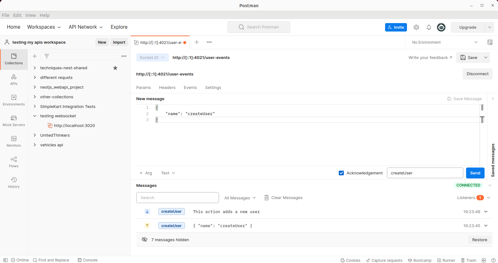
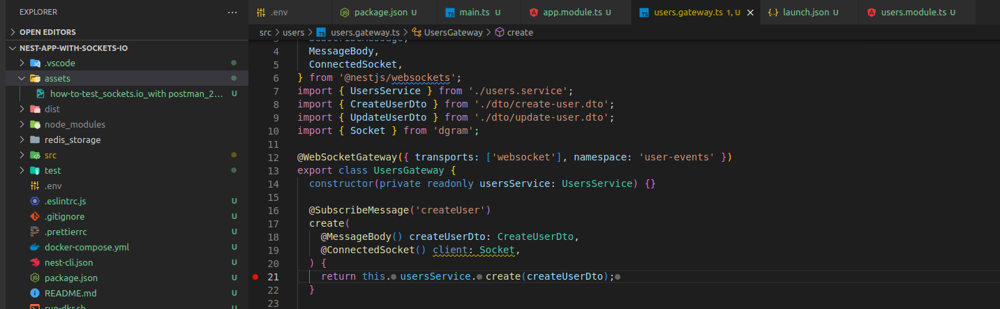

# How to test sockets.io endpoint with postman

Postman configuration with request and acknowledged response

Tested gateway's endpoint

[working with postman](https://blog.postman.com/postman-now-supports-socket-io/)
